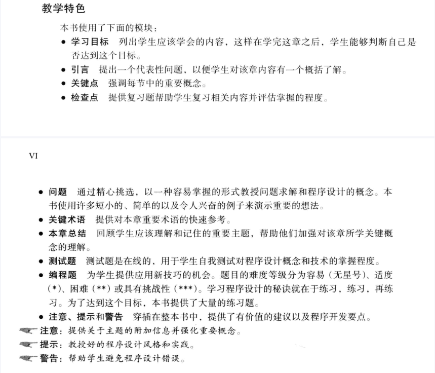

# 01-Preface
《Introduction to Programming Using Python》(《Python语言程序设计》)

## 出版者的话

1. 我觉得最值得大家重视的是作者不论在《Java语言程序设计》还是在本书中所采用的**以问题驱动方式学习程序设计的方法**。我们需要明确一点，**编写程序是为了解决实际问题，而不是纯粹为了做题**。但是，反过来讲，**只有做大量的习题才能从做题过程中培养程序设计的能力，从而达到解决问题的目的**，因此希望大家在学习过程中明确什么是方式，什么是目标。  

2. Python的设计者在开发时的指导思想就是**对于一个特定问题有一种最好的方法来解决就好**，所以希望大家在学习过程中能不断体会到这门语言之美。  

## 前言

1. 什么是程序设计？  
   + **程序设计是指使用程序设计语言编写程序以解决问题**。不论你使用的是哪种程序设计语言，**解决问题和程序设计的根本都是一致的**。

2. 鼓励初学者通过创建图形学习程序设计
    + **Turtle和Thinker都是教授程序设计和面向对象程序设计基础的非常有价值的教学工具**。

3. **本书以问题驱动的方式讲授如何解决问题，这种方式的重点放在问题的解决而不是语法上**。鉴于本书的主线是解决问题，本书提供量大量难易程度各异的问题来激发学生的兴趣。为适用于各个专业的学生，这些问题涉及很多应用领域，例如数学、科学、商业、金融管理、游戏、动画和多媒体等。  

4. Python 中的所有数据都是对象。本书首先将重点放在基础上：**在编写自定义类之前介绍像选择、循环和函数这样的基本程序设计概念和技术**。

5. 教授程序设计的最佳方式是**通过实例**，而学习程序设计的唯一方法就是**通过实践**。我们的目标是使用大量有趣的例子和习题来教授学生**如何解决问题以及如何进行程序设计**。

6. 学习程序设计的秘诀就在于**练习，练习，再练习**。

7. 教学特色
    + 

